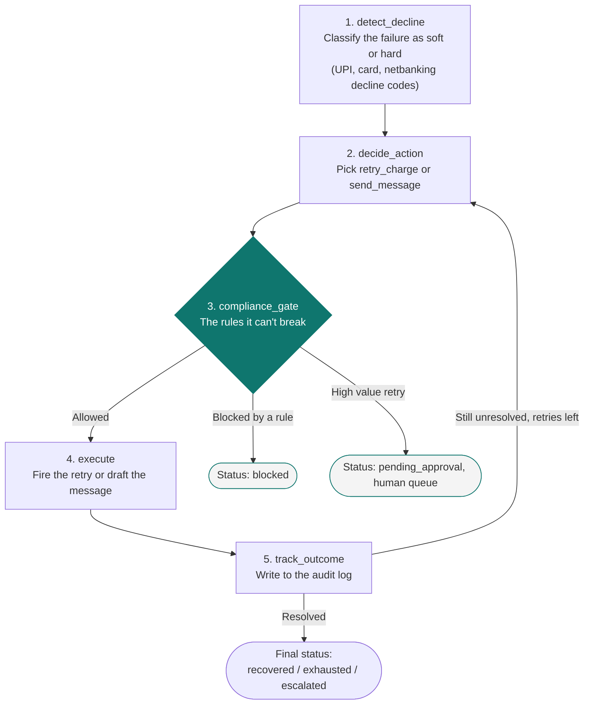
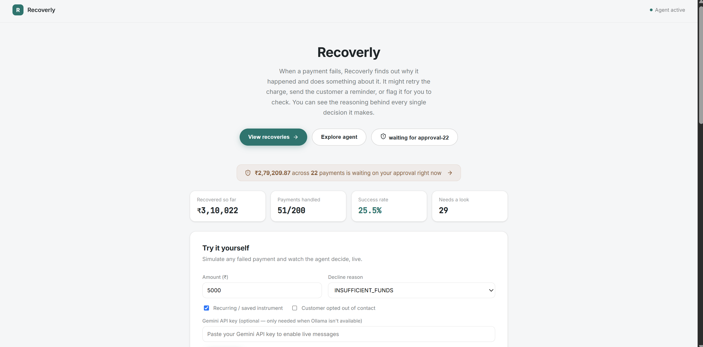
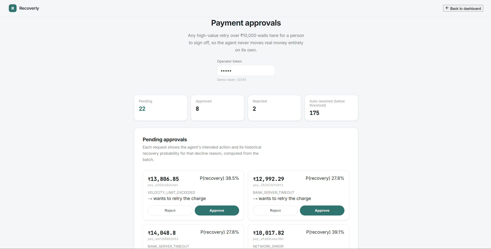
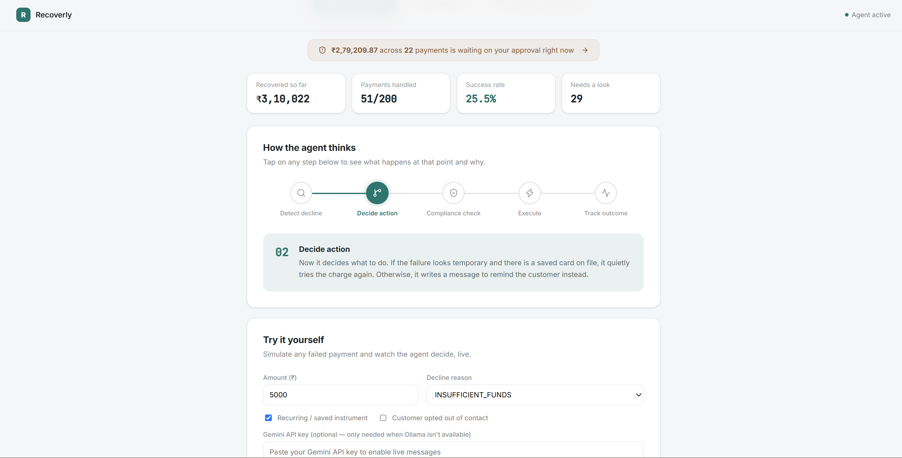
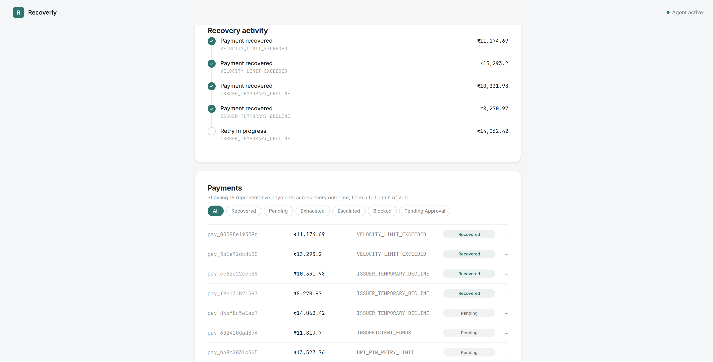

<div align="center">

# Recoverly

**An AI agent that figures out how to recover a failed payment, and knows when it's not allowed to just retry it.**

[](https://www.python.org/)
[](https://fastapi.tiangolo.com/)
[](https://www.postgresql.org/)
[](https://react.dev/)
[](https://www.docker.com/)

**Live app:** [payment-recovery-agent-j8szwylvt-sanjay05.vercel.app](https://payment-recovery-agent-j8szwylvt-sanjay05.vercel.app/)  •  **API docs:** [payment-recovery-agent-q9bi.onrender.com](https://payment-recovery-agent-q9bi.onrender.com/docs)

</div>

---

> A lot of failed payments aren't actually dead. Industry numbers put 80 to 90% of declines in the "soft" bucket: a bank timeout, a card that had a bad millisecond, temporary insufficient funds, not something permanently wrong. That money usually just sits there because nothing ever follows up on it at the right moment. Recoverly is my attempt at closing that gap.

## What it does

Recoverly sits on top of a stream of failed payments, works out why each one actually failed, and decides what to do about it: retry it quietly in the background, or send the customer a nudge. It's not allowed to just pick whichever one it feels like, though. There's a hard rules layer sitting in the middle of the decision loop that it can't talk its way around, a queue where a human has to sign off on anything expensive, and a simulator where you can watch it think through a payment live instead of trusting a screenshot.

## The rule everything else is built around

The agent can only retry a payment silently if there's actually something to retry it against: a saved card, a UPI autopay mandate, an active subscription. A one-time checkout with no saved payment method has nothing left to charge a second time, even if the failure was obviously a fluke like a dropped network connection. In that situation the only honest move is a message asking the customer to try again, not a silent retry pretending to be one.

That's the reason the demo batch recovers around **~38%** of payments instead of some inflated 90%-plus number. About half the batch is one-time payments, and those correctly never get silently retried, only messaged. I'd rather report that number honestly than round it up. Most implementations would probably slap "automatic recovery" on the whole thing and call it a day; this one doesn't, on purpose.

## How the agent actually decides things

Built on **LangGraph**. Five nodes, and it loops through them until the payment lands somewhere final.



**1. `detect_decline`**: Looks at the decline code and calls it either **soft** (recoverable, things like a bank timeout, temporary insufficient funds, network error, velocity limit hit) or **hard** (permanent, things like an expired card, card reported lost or stolen, bad payment address, fraud block). It's working off a playbook of realistic Indian decline codes across UPI, cards, and netbanking, not a generic list.

**2. `decide_action`**: Picks between two things.
- `retry_charge`, but only when the decline is soft, the payment method is recurring or mandate based (so there's a stored authorization to use), and there are retries left.
- `send_message` for everything else: hard declines, one-time payments with nothing saved (even on a soft decline), or once retries have run out.

**3. `compliance_gate`**: This is the node that actually matters most, honestly. It's the safety layer, and it's what stops the agent from just doing whatever seems reasonable in the moment. It blocks:
- Contacting a customer outside 8am to 7pm local time.
- Retrying anything with no stored authorization.
- Retrying a hard decline, full stop.
- Going past the max retry cap for a payment.
- Contacting a customer who's opted out.
- Executing a high value retry automatically. Instead it gets routed to a human approval queue. The agent never gets to move a large amount of money on its own say so.

**4. `execute`**: Actually does the thing. A retry fires as a simulated charge attempt with a unique idempotency key per attempt, so a retry can never accidentally fire twice and double charge someone. A message gets drafted by an LLM (you can swap between a local Ollama model and Google Gemini with one config flag): short, polite, references the amount and why it declined, doesn't hound the customer.

**5. `track_outcome`**: Logs the result. If the payment's still unresolved and there are retries left, it loops back to `decide_action`. Otherwise it ends in one of these: `recovered`, `exhausted`, `escalated`, `blocked`, or `pending_approval`.

Every step gets written to a persistent, human readable audit log, so you can go back and replay exactly why any given payment ended up where it did. None of this is a black box you just have to trust.

## The human approval queue

Any retry above a value threshold (**₹10,000** in the demo config) never fires automatically. It goes into a queue for a human to approve or reject. Message-only actions skip this, since there's no money moving and nothing to gate.

Each item in the queue shows:
- The amount and why it declined.
- What the agent wants to do about it.
- A **recovery probability score**, and this one's real, not a made up confidence number. It's computed from actual historical outcomes in the processed batch: what fraction of past payments with this exact decline reason ended up recovered. Hard declines correctly show **0%**, because they're never retried. I wanted that number to mean something, not just look good in a UI.

The approve/reject endpoints sit behind an operator token check, so having the app's URL isn't enough to approve a payment, you actually need the token. It's a real access boundary, not a button that just looks locked.

## The live simulator

There's a "Try it yourself" panel on the dashboard: pick a decline reason, pick an amount, toggle whether the payment is recurring, toggle whether the customer opted out of contact, then run it and watch what the agent actually decides, live, not a recording. The full audit trail streams in as it happens, along with a plain English sentence explaining why the payment ended up where it did.

If the run needs human approval, there's an "Approve now" button right inside the simulator, so you can walk through the whole human-in-the-loop flow without ever leaving the page.

If there's no local LLM available (which is the case on a hosted version of the app), you can paste in your own Gemini API key and get real generated messages instead of nothing. That key is only used for the one request you made it for, and it's never stored or logged anywhere on the server.

## Screenshots

<div align="center">


*Recoverly's dashboard: a live view of recovered amounts, success rate, and every payment as it moves through the recovery flow*


*The approval queue, with a recovery probability score sitting next to each item*


*The simulator, mid-run, showing the agent's reasoning step by step*


*Payments & Recovery: recovery metrics and the payment stream at a glance*

</div>

## Tech stack

| Layer | Choice |
|---|---|
| Agent orchestration | **LangGraph** (Python) |
| LLM | **Ollama** (llama3.2) locally, **Google Gemini** in deployment. One config flag swaps between them, no code changes |
| Backend API | **FastAPI** + SQLAlchemy |
| Database | **PostgreSQL** |
| Frontend | **React** (Vite), lucide-react for icons |
| Containerization | **Docker Compose**: Postgres, the FastAPI backend, and the React frontend as three services |

## Design direction

The UI goes for a calm, fintech-ish look rather than anything flashy:

- Accent color is a deep teal (`#0f766e`)
- Dark charcoal text on off-white, not stark black-and-white, not a rainbow of colors either
- **Inter** for body text, **JetBrains Mono** for anything data-like (amounts, payment IDs, decline codes), because a monospace font makes numbers feel like a ledger instead of a website
- No gradients, no glassmorphism, no heavy shadows. Flat cards, thin 1px borders
- Branded "Recoverly," with a small square "R" as the mark

## The numbers, from the demo dataset

On a synthetic batch of 200 failed payments (fixed seed, so it's reproducible):

- **200** payments processed
- **~76 to 77 recovered**, around **38%**
- Roughly **₹6,40,000+** recovered out of about **₹16,50,000+** in total failed amount
- A handful correctly **blocked** by compliance rules: opted-out customers, contact-hours violations, that kind of thing
- Dozens of high value payments correctly sent to **human approval** instead of being executed on their own

## Setup

**You'll need:** Python 3.11+, Node.js 18+, Docker Desktop, and either a local Ollama install (free, local LLM) or a Google Gemini API key (cloud LLM).

### Step 1: Start the database

```bash
docker compose up -d postgres
docker exec -i <postgres_container_name> psql -U <db_user> -d <db_name> < schema.sql
```

### Step 2: Set up and run the backend

```bash
pip install -r requirements.txt
python -m app.generate_dataset --n 200 --seed 42 --out payments.json
python -m app.run_batch
uvicorn app.main:app --reload
```

This defaults to a local Ollama model. To switch to Gemini, set `LLM_PROVIDER=gemini` and provide a Gemini API key, either as an environment variable, or by pasting it into the simulator's key field in the app itself.

### Step 3: Set up and run the frontend

```bash
cd frontend
npm install
npm run dev
```

Open the app at whatever local address Vite prints, usually `http://localhost:5173`.

### Or, skip steps 2 and 3 and just run it all in Docker

```bash
docker compose up --build -d
```

> **One thing to know:** approving or rejecting items in the human approval queue requires a demo operator token. If those buttons in the UI don't seem to do anything, check that the token's environment variable is actually set. It's a real access boundary, not decoration.

---

<div align="center">

Built around one question: if you're not going to guess, what's the honest thing an agent can actually do here?

</div>

---

**Sanjay Jat** — [GitHub](https://github.com/Sanjay-jat) · [LinkedIn](https://www.linkedin.com/in/sanjay-jat-250767346) · [sanjayjat354339@gmail.com](mailto:sanjayjat354339@gmail.com)
 
## License
 
[MIT](https://github.com/Sanjay-jat/Recoverly/blob/main/LICENSE) © 2025 Sanjay Jat