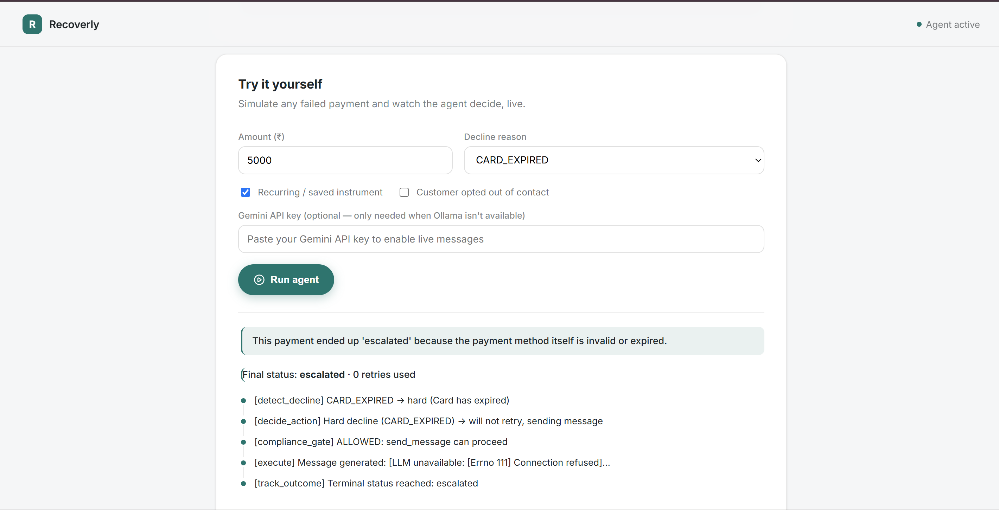
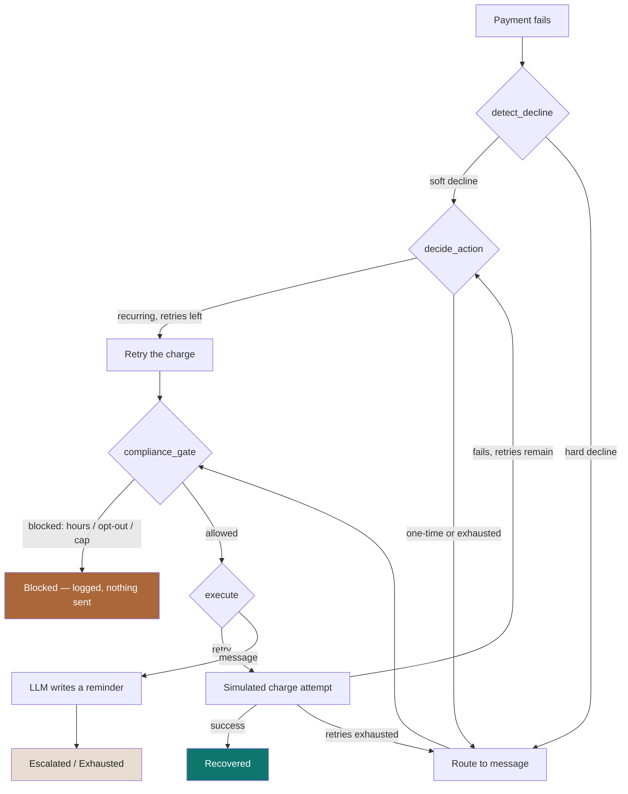

<div align="center">
# Recoverly
 
### An AI agent that chases down the payments that got away.
 
Built for the **Razorpay AI Buildathon 2026** — Track 03, AI Revenue Recovery.
 


 
</div>
> Most failed payments aren't actually lost — nobody just followed up.
> Recoverly is the agent that does.
 
---
 
## Why this exists
 
Somewhere between 80–90% of failed payments are what the industry calls
"soft declines" — a bank server hiccuped, a balance was momentarily low, a
network call timed out. Nothing permanently wrong. In most systems, that
revenue just evaporates because no one retries it or reminds the customer
at the right moment.
 
Recoverly is a small, focused agent that does exactly that one job well: it
looks at a failed payment, figures out *why* it failed, and decides — on
its own, within rules it's not allowed to break — whether to quietly retry
it or send the customer a nudge.
 
## See it in action
 
<div align="center">

 
*The dashboard — recovery metrics, the agent's reasoning flow, and every payment in the ledger.*
 
<br/>

 
*The built-in simulator — trigger a real agent decision on any scenario and watch the reasoning happen live.*
 
</div>
> Drop your own screenshots into `docs/screenshot-dashboard.png` and
> `docs/screenshot-simulator.png` — a full-page browser capture of the
> running app is enough.
 
---
 
## How the agent actually thinks
 
This isn't a marketing diagram — it's the real shape of the LangGraph loop
in `app/agent/graph.py`. Every arrow below is a code path you can trace.
 

 
| Step | What it's actually checking |
|---|---|
| **detect_decline** | Is this soft (recoverable) or hard (permanent)? Uses a playbook of real Indian decline codes across UPI, card, and netbanking. |
| **decide_action** | Retry, or message? Depends on the decline type, whether there's a stored payment method to retry against, and retries left. |
| **compliance_gate** | The part that keeps the agent honest: no contact outside 8am–7pm IST, never retry a payment with no stored authorization, never retry a hard decline, respect the retry cap, respect opt-outs. |
| **execute** | Either fires a simulated retry (with an idempotency key, so nothing ever double-charges) or has an LLM draft a short, polite reminder. |
| **track_outcome** | Logs what happened and loops back if the payment's still unresolved and there's another attempt left. |
 
## The rule everything else follows from
 
An agent can only *silently* retry a payment if there's something to retry
it against — a saved card, a UPI autopay mandate, a subscription. A one-time
checkout with no saved instrument has nothing to charge a second time, no
matter how obviously temporary the failure was. In that case, the honest
move is a customer-facing reminder, not a fake retry.
 
That's also why the recovery rate on the demo batch is **38.5%**, not
90%+ — close to half the batch is one-time payments that correctly never
get silently retried, only messaged.
 
---
 
## What it's built with
 
<div align="center">
| Layer | Choice |
|---|---|
| Agent orchestration | LangGraph |
| LLM | Ollama (`llama3.2`) for local dev, Gemini for deployment — one config flag apart |
| Backend | FastAPI + SQLAlchemy |
| Database | PostgreSQL |
| Frontend | React (Vite) + lucide-react |
| Containerized | Docker Compose — Postgres, backend, and frontend together |
 
</div>
## Running it yourself
 
**Database**
```bash
docker compose up -d postgres
docker exec -i recovery_agent_db psql -U sanju -d recovery_agent < schema.sql
```
 
**Backend**
```bash
pip install -r requirements.txt
python -m app.generate_dataset --n 200 --seed 42 --out payments.json
python -m app.run_batch
uvicorn app.main:app --reload
```
Uses local Ollama by default. Set `LLM_PROVIDER=gemini` with a Gemini key to
switch — or just paste a key into the simulator itself.
 
**Frontend**
```bash
cd frontend
npm install
npm run dev
```
Then open `http://localhost:5173`.
 
**Or skip all of that and run it in one shot:**
```bash
docker compose up --build -d
```
 
## The live simulator
 
The dashboard isn't just a report on a batch that already ran — there's a
"Try it yourself" panel where you can pick any decline reason, amount, and
recurring/opt-out combination, and watch the agent make a real decision on
it, live, with the full audit trail unfolding in front of you.
 
No Ollama running? Paste a Gemini API key straight into the simulator —
it's used for that one request and never stored or logged anywhere.
 
## What the numbers actually say
 
<div align="center">
| Metric | Value |
|---|---|
| Total processed | 200 |
| Recovered | 77 (38.5%) |
| Amount recovered | ₹6,42,034 of ₹16,56,536 |
| Blocked by compliance rules | 5 |
 
</div>
## The messy parts
 
[`DECISIONS.md`](./DECISIONS.md) has the honest, unedited log of what broke
and why — a UTC-vs-IST bug that blocked messages during valid business
hours, a duplicate endpoint that silently served stale data, an LLM call
with no timeout that hung instead of failing gracefully. Worth a read if
you want to see how this was actually built, not just the finished shape.
 
---
 
<div align="center">
*Built by Sanjuu for the Razorpay AI Buildathon 2026.*
 
</div>
 